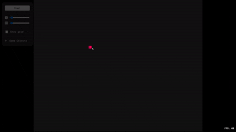

# Game of Life (PixiJS)

A modern, interactive implementation of Conway's Game of Life using [PixiJS](https://pixijs.com/).  
This project features a fast, scalable grid, pattern selection, and a smooth UI.



## Features

- **Fast rendering** with PixiJS
- **Pattern library**: Insert classic Game of Life objects (block, glider, pulsar, etc.)
- **Drag and zoom** the grid
- **Adjustable speed** and cell size
- **Responsive UI** with custom controls
- **FPS counter**

## Getting Started

### Prerequisites

- [Node.js](https://nodejs.org/) (v16+ recommended)
- [npm](https://www.npmjs.com/) or [yarn](https://yarnpkg.com/)

### Installation

1. Clone the repository:
    ```sh
    git clone https://github.com/yourusername/game-of-life.git
    cd game-of-life
    ```

2. Install dependencies:
    ```sh
    npm install
    # or
    yarn install
    ```

3. Start the development server:
    ```sh
    npm run dev
    # or
    yarn dev
    ```

4. Open [http://localhost:5173](http://localhost:5173) (or the port shown in your terminal) in your browser.

## Usage

- **Start/Stop**: Use the button to start or pause the simulation.
- **Speed**: Adjust the simulation speed with the slider.
- **Grid Size**: Zoom in/out using the grid size slider or mouse wheel.
- **Drag**: Click and drag to move the grid.
- **Insert Patterns**: Click "Game Objects", select a pattern, then click on the grid to place it.
- **Show Grid**: Toggle the grid overlay.

## Project Structure

```
src/
  main.js         # Main application logic
  data.js         # Game object patterns
  universe.js     # Universe (grid) logic
public/
  style.css       # Styles
  assets/objects/ # Pattern images
index.html        # App entry point
```

## Patterns Included

- Block
- Beehive
- Barge
- Boat
- Long Boat
- Ship
- Tub
- Pond
- Loaf
- Glider
- Mango
- Pulsar
- Blinker
- Snake

## Credits

- [PixiJS](https://pixijs.com/)
- [Font Awesome](https://fontawesome.com/)
- [Geist Mono](https://vercel.com/font)

## License

MIT License

---
Enjoy experimenting with Conway's Game of Life!